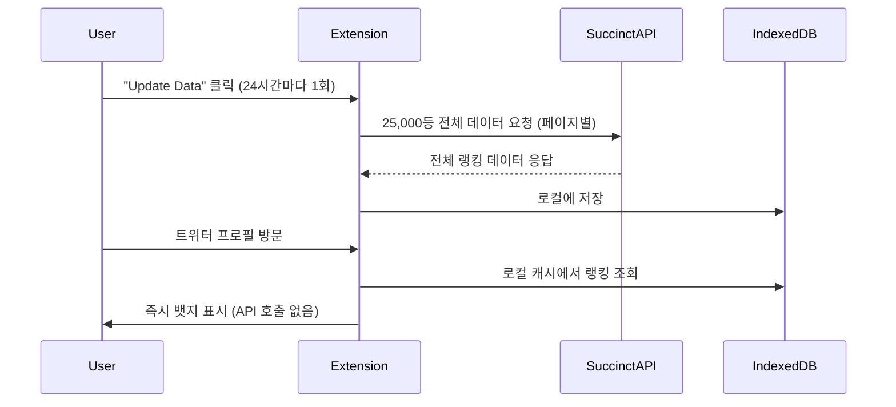

# Proof of Stars Chrome Extension

트위터(X) 프로필에 Succinct Proof of Stars 랭킹 정보를 뱃지 형태로 표시하는 크롬 익스텐션입니다.

## 주요 기능

- 🏆 트위터 프로필에 랭킹 뱃지 표시
- ⚡ **25,000등까지의 데이터를 로컬에 캐시하여 빠른 응답**
- 💾 IndexedDB 기반 고성능 캐시 시스템
- 🔄 24시간마다 자동 데이터 업데이트
- 📊 실시간 캐시 상태 모니터링
- 🎨 핑크 테마의 아름다운 UI
- 🔘 **뱃지 on/off 토글 기능**
- ⏰ **24시간 쿨다운으로 서버 부하 방지**

## 새로운 캐시 시스템

### IndexedDB 기반 로컬 캐시
- **25,000등까지의 랭킹 데이터**를 사용자 브라우저에 저장
- 트위터 프로필 방문 시 **즉시 뱃지 표시** (API 호출 없음)
- **오프라인 지원**: 캐시된 데이터만으로도 뱃지 표시 가능

### 데이터 플로우


### 캐시 관리
- **자동 업데이트**: 24시간마다 자동으로 데이터 갱신
- **수동 업데이트**: 팝업에서 "Update Data" 버튼으로 즉시 갱신
- **쿨다운 시스템**: 24시간 쿨다운으로 서버 부하 방지
- **상태 모니터링**: 캐시 크기, 마지막 업데이트 시간 실시간 표시
- **직접 API 호출**: Vercel 서버 없이 직접 Succinct Stats API 호출

### 뱃지 제어
- **Show Badges 토글**: 뱃지 표시/숨김 기능
- **실시간 적용**: 토글 변경 시 즉시 모든 트위터 탭에 적용
- **상태 저장**: 브라우저 재시작 후에도 설정 유지

## 설치 방법

### 1. 개발자 모드 활성화
1. Chrome 브라우저에서 `chrome://extensions/` 접속
2. 우측 상단의 "개발자 모드" 토글 활성화

### 2. 익스텐션 로드
1. "압축해제된 확장 프로그램을 로드합니다" 버튼 클릭
2. 이 프로젝트 폴더 선택

### 3. 초기 설정
1. 익스텐션 아이콘 클릭
2. "Update Data" 버튼 클릭하여 25,000등까지의 데이터 다운로드
3. 다운로드 완료 후 트위터에서 뱃지 확인

## 사용법

1. **초기 설정**: 익스텐션 팝업에서 "Update Data" 클릭
2. **뱃지 제어**: "Show Badges" 토글로 뱃지 표시/숨김
3. **트위터 접속**: 트위터(X) 웹사이트 접속
4. **자동 표시**: 프로필에 랭킹 뱃지가 자동으로 표시됨

## 뱃지 스타일

- **핑크 배경**: 브랜드 컬러인 핑크 테마
- **랭킹 표시**: "1st", "2nd", "3rd" 등의 서수 형태
- **스타 아이콘**: SVG 스타 아이콘과 스타 수량 표시
- **반응형**: 트위터 피드와 프로필 페이지에서 일관된 크기

## API 서버

### 엔드포인트
- **개별 사용자**: `GET /rankings?username=USERNAME`
- **전체 데이터**: `GET /rankings/all` (25,000등까지)
- **헬스 체크**: `GET /health`
- **캐시 새로고침**: `POST /refresh`

### 데이터 형식
```json
{
  "username": "username",
  "rank": 15,
  "stars": 12500,
  "proofs": 45,
  "cycles": 1500000,
  "category": "succinct",
  "lastUpdated": "2024-01-15T10:30:00Z"
}
```

## 파일 구조

```
├── manifest.json          # 익스텐션 매니페스트
├── content.js             # 콘텐츠 스크립트 (뱃지 표시)
├── background.js          # 백그라운드 서비스 워커 (IndexedDB 관리)
├── popup.html             # 팝업 UI (캐시 상태 표시)
├── popup.js               # 팝업 로직 (업데이트 관리)
├── styles.css             # 뱃지 스타일
├── api/
│   └── index.js           # API 서버 (Vercel)
├── icons/                 # 익스텐션 아이콘
└── README.md              # 프로젝트 설명
```

## 기술 스택

### 프론트엔드
- **Chrome Extension Manifest V3**
- **IndexedDB**: 대용량 랭킹 데이터 저장
- **Service Worker**: 백그라운드 데이터 관리
- **Content Script**: DOM 조작 및 뱃지 표시

### 백엔드
- **Vercel Serverless Functions**
- **Node.js**: API 서버
- **CORS**: 크로스 오리진 요청 처리
- **캐싱**: 1시간 캐시로 API 호출 최적화

## 개발

### 로컬 개발
1. 프로젝트 폴더에서 파일 수정
2. `chrome://extensions/`에서 "새로고침" 버튼 클릭
3. 트위터 페이지 새로고침하여 변경사항 확인

### 디버깅
- **콘텐츠 스크립트**: 개발자 도구 > Console
- **백그라운드**: `chrome://extensions/` > "세부정보" > "백그라운드 페이지 검사"
- **IndexedDB**: 개발자 도구 > Application > Storage > IndexedDB

### API 서버 배포
```bash
# Vercel CLI 설치
npm i -g vercel

# 배포
vercel --prod
```

## 성능 최적화

### 캐시 전략
- **IndexedDB**: 25,000개 랭킹 데이터 저장 (약 2-3MB)
- **배치 처리**: 대량 데이터 효율적 저장
- **지연 로딩**: 필요할 때만 데이터 조회

### 메모리 관리
- **unlimitedStorage**: 대용량 데이터 저장 허용
- **자동 정리**: 오래된 캐시 데이터 자동 삭제
- **에러 처리**: 네트워크 오류 시 기존 캐시 사용

## 브라우저 지원

- Chrome 88+
- Edge 88+
- 기타 Chromium 기반 브라우저

## 라이선스

MIT License

## 기여

버그 리포트나 기능 제안은 이슈로 등록해 주세요.

## 주의사항

- **초기 다운로드**: 첫 실행 시 25,000등 데이터 다운로드로 시간 소요
- **저장 공간**: 약 2-3MB의 로컬 저장 공간 사용
- **네트워크**: 초기 다운로드와 자동 업데이트 시 인터넷 연결 필요
- **트위터 UI 변경**: 트위터의 UI 변경 시 익스텐션 업데이트 필요
- **쿨다운**: 수동 업데이트는 24시간 쿨다운 적용 